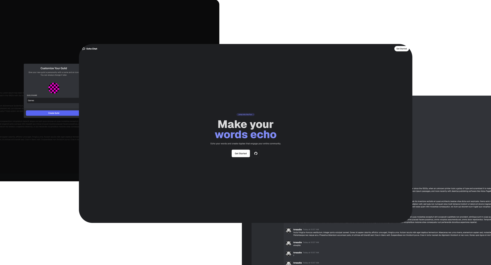
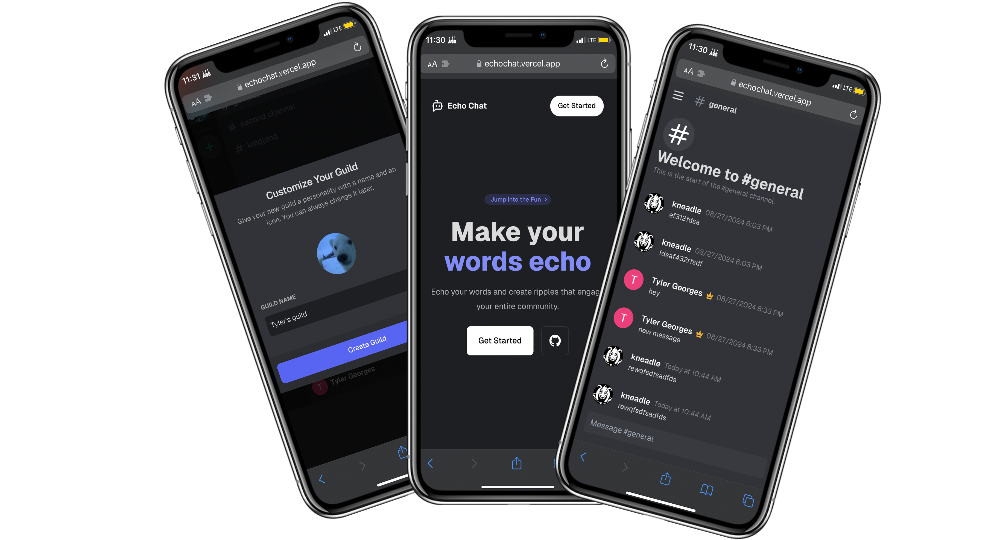

<div align="center">

<h1 align="center">Echo Chat</h1>
  
  


[](https://choosealicense.com/licenses/mit/)


<p align="center">

**Echo Chat | A Real Time Discord Clone Application Powered by Next.js, Supabase, React Query** This project reimagines discord, while keeping features such as real-time communication using a modern tech stack.

 <br />
 <br />
    <a href="https://echochat.vercel.app/">View Demo</a>
      .
    <a href="https://github.com/tylergeorges/echochat/issues">Report Bug</a>
     .
    <a href="https://github.com/tylergeorges/echochat/pulls">Request Feature</a>
<p>

<br>
<hr>
</div>

<br>




### Built With

- 
- 
- 
- 
- 
-  

## Features

- 🔒 **Authentication + Google Auth** With **Supabase**
- 📱 **Real-time** messaging using Supabase
- 🎉 **Create Guilds** and invite your friends

---

- 🔍 **Join your friends** guilds
- 🚀 **Optimistic Updates** for instant user feedback and improved UX
- 🎊 **Responsive Design**

## Getting Started

First, run the development server:

1. Clone or Fork the repo

   ```sh
   git clone https://github.com/tylergeorges/echochat.git
   cd ./your_project
   ```

2. Install Dependencies

   ```sh
   pnpm install
   ```

3. rename `.env.example` file to `.env`

4. Start the server

   ```sh
   pnpm dev
   ```

Open [http://localhost:3000](http://localhost:3000) with your browser to see the result.

You can start editing the page by modifying `app/page.tsx`. The page auto-updates as you edit the file.

## Deploy on Vercel

The easiest way to deploy your Next.js app is to use the [Vercel Platform](https://vercel.com/new?utm_medium=default-template&filter=next.js&utm_source=create-next-app&utm_campaign=create-next-app-readme) from the creators of Next.js.

Check out our [Next.js deployment documentation](https://nextjs.org/docs/deployment) for more details.

<!-- CONTRIBUTING -->

## Contributing

Contributions are what make the open source community such an amazing place to learn, inspire, and create. Any contributions you make are **greatly appreciated**.

If you have a suggestion that would make this better, please fork the repo and create a pull request. You can also simply open an issue with the tag "enhancement".
Don't forget to give the project a star! Thanks again!

1. Fork the Project
2. Create your Feature Branch (`git checkout -b feature/AmazingFeature`)
3. Commit your Changes (`git commit -m 'Add some AmazingFeature'`)
4. Push to the Branch (`git push origin feature/AmazingFeature`)
5. Open a Pull Request
